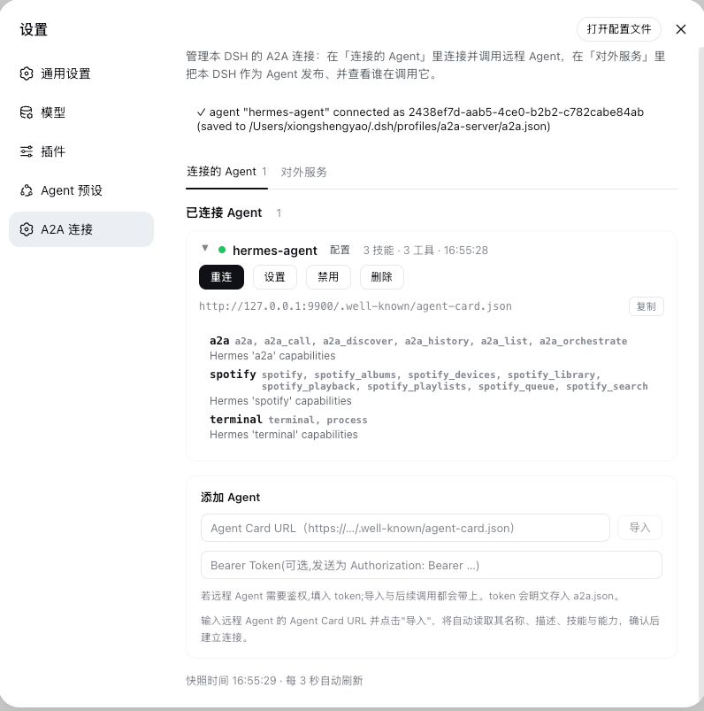
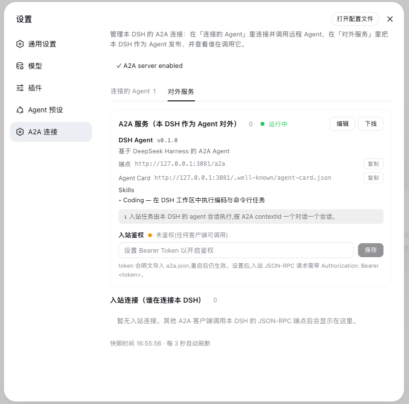

# dsh-a2a

[中文文档](./README.md) | **English**

A **DeepSeek Harness (DSH)** plugin that implements the **Agent2Agent (A2A) Protocol v1.0** (Linux Foundation, `a2aproject/A2A`, Apache-2.0).

It turns a DSH instance into a full A2A peer in both directions:

- **Client mode (outbound)** — discover a remote agent via its **AgentCard**, map each **skill** to a DSH model tool (`a2a__<name>__<skill>`), and execute remote tasks through A2A **JSON-RPC**.
- **Server mode (inbound)** — expose this DSH to other agents: `/.well-known/agent-card.json` plus a JSON-RPC endpoint (`SendMessage`, `GetTask`, `ListTasks`, `CancelTask`, `SendStreamingMessage` over SSE) on the DSH webserver.

## Features

### Protocol surface (A2A v1.0)

- **Discovery**: `GET /.well-known/agent-card.json` (well-known first, configured URL fallback)
- **Unary**: `SendMessage`, `GetTask`, `ListTasks`, `CancelTask`, `GetExtendedAgentCard`
- **Streaming**: `SendStreamingMessage` (SSE) / `SubscribeToTask`, with `TaskStatusUpdateEvent` + `TaskArtifactUpdateEvent`
- **Task lifecycle**: `SUBMITTED → WORKING → COMPLETED / FAILED / CANCELED / REJECTED / INPUT_REQUIRED / AUTH_REQUIRED`
- **Auth**: outbound sends a per-agent Bearer token (`Authorization: Bearer …`); inbound can protect the endpoint with a shared Bearer token — when set, the AgentCard declares a `bearerAuth` scheme and requests without/with a wrong token get 401 (both unary calls and the SSE stream)
- **Types**: `Task`, `Message`, `Part` (text/raw/url/data), `Artifact`, `AgentCard`, security schemes, extensions

### Connection dashboard (设置 → A2A 连接)

The panel is split into two tabs by **role**, and **everything is configurable in the UI — no need to hand-edit `a2a.json`**:

**"Connected agents" (this DSH as a client, outbound)**

- Lists connected remote agents (name, connection state, AgentCard URL, skill/tool counts, last activity); expand to see each skill's name/tags/description. Each agent has **Reconnect / Settings / Disable / Delete** controls (a disabled agent shows as a greyed-out placeholder card whose control becomes **Enable**).
- **Settings** — edit that agent's **timeout (timeoutMs)**, **skill mapping (mapSkills)**, and **Bearer token** in place; saving reconnects with the new config to apply it.
- **Add agent** — enter an AgentCard URL (optional Bearer token) → "Import" to preview the remote name/description/skills → "Connect". Config is written back to `a2a.json`.

**"Public service" (this DSH as an agent, inbound)**

- **Visual identity editing** — read-only view of the service name/description/version, endpoint, Agent Card URL (one-click copy) and Skills; click "Edit" to change these fields in place and **fully add/edit/remove Skills**, saving rebuilds the AgentCard immediately (no restart).
- **Guided setup** — on a fresh install (no `a2a.json`), this tab shows a form pre-filled with sensible defaults; tweak as needed and click "Create & go online" to publish the service — one step generates `a2a.json` and starts serving.
- **Online / offline** toggle; shows **who executes inbound tasks** (custom executor / this DSH's agent session / none).
- **Inbound auth** — set or clear the shared Bearer token that gates the endpoint (persisted to `a2a.json`, effective immediately).
- **Inbound peers** — who is calling this DSH (label, source address, first/last seen, task count, streaming flag), with a close control.
- The panel refreshes every 3 s; `/a2a/api` serves a JSON snapshot and control endpoints, fenced to loopback/same-origin (the token value is never returned in the snapshot — only whether one is configured).

### Runtime configuration (a2a.json)

Configuration is driven by **`a2a.json`** (per profile, fully manageable from the
UI) — manage agents and the public service without touching the composition. The
file is resolved from the active profile, not the launch directory: the plugin
parses `--profile <name>` from the process command line (the `dsh web` alias is
recognized as the `web` profile too) and reads/writes
`~/.dsh/profiles/<name>/a2a.json` — configs the UI generates on first use also
land in that profile directory, so they are read no matter which working
directory you launch from. Hand-writing `a2a.json` is still supported (below),
but **a new user can do everything through the UI**.

## Screenshots

| Connected agents (this DSH as a client) | Public service (this DSH as an agent) |
|---|---|
|  |  |

## Installation

### Option 1: from npm (recommended)

Once published to npm, install into the target profile with one command and
restart:

    dsh plugin --profile <profile> add @ryubyte/dsh-a2a
    dsh --profile <profile>

`dsh plugin` installs the package into the profile and auto-registers the
plugin layer (this package declares `dsh.bundle.patch` in `package.json`) — no
manual configuration is needed.

### Option 2: from the repository (development)

For hacking on the code, requires Node.js >= 22:

    # 1. Clone the repo
    git clone https://github.com/ryubyte/dsh-a2a.git
    cd dsh-a2a

    # 2. Install deps and build
    npm install
    npm run build

    # 3. Link into the target profile
    dsh plugin --profile <profile> add link:$(pwd)

    # 4. Restart
    dsh --profile <profile>

After changing source, re-run `npm run build` and restart.

## Usage

### 1. Configure a remote agent (outbound)

Declare agents to connect to in the profile's `a2a.json`:

```jsonc
{
  "agents": [
    {
      "name": "research",
      "agentCardUrl": "https://research.example.com/.well-known/agent-card.json",
      // "bearerToken": "...",
      // "timeoutMs": 8000,
      // "mapSkills": true,
      // "enabled": false        // keep the entry, but don't auto-connect
    }
  ]
}
```

Alternatively, in the Web GUI go to 设置 → A2A 连接 → "Connected agents" → Add
agent, paste an AgentCard URL to import and connect — the config is written back
to `a2a.json`. After connecting, the agent's "Settings" lets you adjust its
timeout, skill mapping, and token.

Once connected, the remote agent's skills appear as model tools:
`a2a__<name>__<skill>`.

A local agent session's repeated tool calls to a given remote agent reuse one
A2A `contextId`, so they land in the same remote session with cross-turn memory;
different local sessions are isolated into separate conversations.

### 2. Expose this DSH as an A2A agent (inbound)

> **Recommended: use the UI.** Open 设置 → A2A 连接 → "Public service"; a fresh
> install shows a pre-filled form — tweak a few fields and click "Create & go
> online". No hand-written JSON required. The config below is the equivalent
> for reference or scripted deployment.

Or enable server mode manually in `a2a.json`:

```jsonc
{
  "mode": "server",
  "server": {
    "enabled": true,             // explicitly turn the inbound server on
    // "baseUrl": omit to auto-infer (see below); set only behind a proxy / public domain
    "agentName": "My DSH Agent",
    "agentDescription": "A DSH agent over A2A v1.0",
    "agentVersion": "0.1.0",
    "skills": [
      { "id": "coding", "name": "Coding", "description": "Execute coding and shell tasks.", "tags": ["coding", "shell"] }
    ]
  }
}
```

When `baseUrl` is left empty (or cleared in the UI), the AgentCard auto-infers the webServer's **real listen address**, so it never advertises a stale port; set it explicitly only when this DSH sits behind a reverse proxy or public domain whose external address differs from the local listener.

> **About `mode`**: `mode` (`client` / `server` / `both`) selects which half mounts at startup, defaulting to `client`. It is **optional** — `server.enabled: true` or the presence of `agents` turns on the respective half, so an `a2a.json` generated through the UI usually **omits `mode`** and relies on those fields. Writing `mode` by hand is clearer but equivalent.

Other A2A clients discover this DSH via the auto-inferred
`http://<host>:<port>/.well-known/agent-card.json` and call the `/a2a` endpoint.

#### Who executes an inbound task (executor precedence)

On each inbound task the server picks an executor in this order:

1. **Explicit `execute`** (injected programmatically) — yours wins.
2. **This DSH's own agent session** (the default, when an agent loop is
   present) — **one session per A2A `contextId`**: the first task for a context
   `ctx.agents.create()`s a session (later tasks for the same context reuse it,
   so history accumulates; a restarted process `resume`s it on demand), sends
   the message as a `next-turn` waking item, awaits `whenIdle()`, and takes the
   latest assistant reply as the A2A artifact. Concurrent tasks for one context
   are serialized; distinct contexts run in parallel. Sessions are not disposed
   per task (that would defeat context accumulation) — all are disposed on
   plugin unload/disable. Turning on server mode is enough — no code.
3. **`notConfiguredExecutor`** (fallback) — when nothing is injected *and* no
   usable agent loop is composed (e.g. a bare dsh-base profile), it returns
   "no executor configured — inject one" and **runs nothing**.

> On "present": `ctx.agents` (the registry) existing ≠ being able to create an
> agent. `create()` needs a factory registered by an agent-loop plugin; without
> it `create()` rejects and the DSH agent executor surfaces that as a readable
> error rather than throwing. So a minimal profile still needs an explicit
> executor.
>
> Session ↔ cwd: a DSH session validates `cwd` as an absolute path and freezes
> it into the session header at creation. Inbound sessions use a **dedicated**
> cwd `<profile>/.a2a-sessions` (kept separate from the profile root so they
> don't crowd your interactive sessions). They appear in the session list's
> "Ungrouped" bucket, each named `A2A: <first-prompt summary>` (inbound messages
> carry a plugin source, which DSH's automatic titling ignores, so we name it
> explicitly). Naming is cosmetic — failures are logged, never failing the task.
>
> Cancellation: `CancelTask` aborts the running task's executor signal, actually
> stopping the agent turn (not just flipping task status).
>
> For local testing you may still pass `shellExecutor`, which runs the prompt as
> a `/bin/sh -c` command — trusted clients only. For production put a TLS
> reverse proxy in front and set `authToken` as needed.

### 3. Programmatic use

```ts
import { A2AClient, A2AServer, TaskStore } from '@ryubyte/dsh-a2a';

// outbound: connect to a remote agent
const client = await A2AClient.connect('https://agent.example.com');
const { task } = await client.sendMessage({
  messageId: crypto.randomUUID(),
  role: 'ROLE_USER',
  parts: [{ text: 'Draft a report' }],
});
for await (const ev of client.streamMessage({ messageId: crypto.randomUUID(), role: 'ROLE_USER', parts: [{ text: 'hi' }] })) {
  // ev.statusUpdate | ev.artifactUpdate | ev.task | ev.message
}

// inbound: wire a custom executor to your own agent loop
const store = new TaskStore();
const server = new A2AServer({
  baseUrl: 'http://127.0.0.1:3080',
  agentName: 'My DSH',
  agentDescription: '...',
  agentVersion: '1.0.0',
  execute: async ({ message }) => ({
    messageId: crypto.randomUUID(),
    role: 'ROLE_AGENT',
    parts: [{ text: await myAgentRun(message.parts) }],
  }),
}, store);
```

## Directory structure

    src/
      protocol.ts        # A2A v1.0 types & constants
      card.ts            # AgentCard discovery / validation
      jsonrpc.ts         # JSON-RPC 2.0 + SSE transport
      client.ts          # outbound client (A2AClient)
      server.ts          # inbound server + TaskStore (A2AServer)
      outbound.ts        # skill → model-tool bridge (registerAgentTools)
      dashboard.ts       # connection registry + control
      a2a-config.ts      # runtime a2a.json parsing / persistence
      index.ts           # Cordis plugin entry (client / server modes)
      client/
        index.ts         # browser half: settings "A2A 连接" panel
    lib/                 # build output (index.js + client.js + types/)
    scripts/
      build-client.mjs   # wrap client bundle (__ModuleLoader__)
      capture-shots.mjs  # README screenshot capture (headless Chrome + CDP)
    cordis.patch.yml     # plugin registration row (self-mounted bundle)
    package.json         # dsh.bundle.patch + dsh.client manifest

## How it works

- The plugin reads `ctx.webServer` and `ctx.tools` as context properties inside
  `ctx.inject(...)` / `ctx.effect(...)` — the native Cordis pattern used by DSH
  bundles (`dsh-client-hmr`, …). A composition missing either half simply idles
  that half; nothing crashes.
- **`baseUrl` is optional in server mode**: when omitted the AgentCard
  advertises the webserver's real listen address, so ephemeral ports never
  publish a stale URL. When bound to `127.0.0.1` that loopback address is
  advertised; when bound to `0.0.0.0` the plugin derives the machine's LAN
  address (reachable by remote Agents), falling back to `127.0.0.1` only when
  none exists. Set it explicitly only when a reverse proxy fronts the
  instance.
- Client-mode connection lifecycle hooks (`onReady` / `onDispose`) feed a
  **process-wide shared registry**; multiple instances (client + server) share
  it, and `/a2a/api` is registered once per process.
- All registrations are fiber-scoped: Cordis disposes them on plugin
  stop/update.
- Disabled agents (`enabled: false`) show as grayed-out placeholder cards and
  are **not** reconnected on restart until re-enabled.

## Known limitations

- The dashboard API (`/a2a/api`) listens on loopback / same-origin only; it
  carries no secrets and exists for operator visibility.
- Inbound execution follows the [executor precedence](#who-executes-an-inbound-task-executor-precedence):
  with an agent loop present it defaults to this DSH's own cwd-bound
  session; otherwise (and with nothing injected) it **refuses** and returns
  "no executor configured". `shellExecutor` is local-testing only. Whatever the
  executor, never expose server mode to untrusted networks (no auth by default
  unless you set `authToken`).
- The A2A spec requires HTTPS for production `AgentInterface.url`; DSH's
  webserver binds loopback by default, so put a TLS reverse proxy in front
  before exposing beyond localhost.
- Bearer tokens — both the outbound per-agent token and the inbound endpoint
  `authToken` — are stored in plaintext in `a2a.json`; secure the file yourself.

## Development

```bash
npm install
npm run build    # tsc(types) + tsdown(lib) + wrap client → lib/client.js
npm test         # node:test + tsx (unit/integration) + client-bundle smoke
```