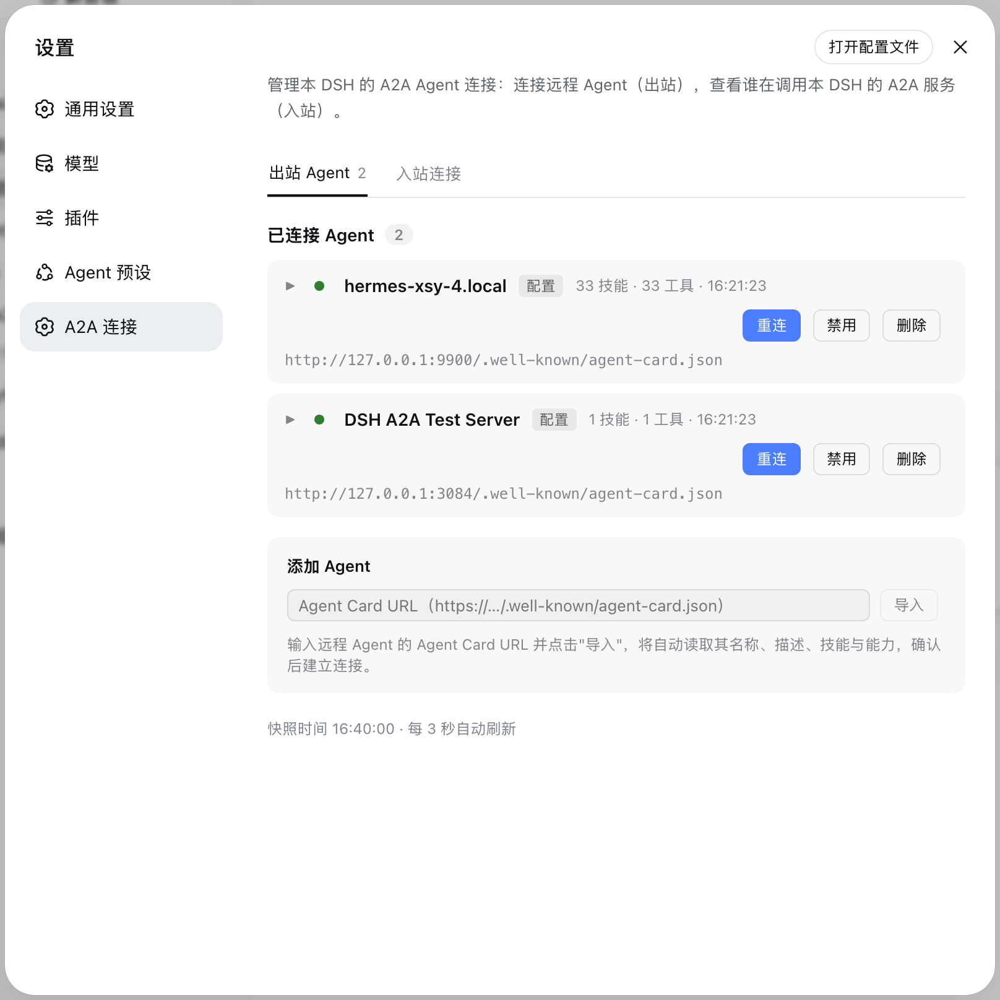
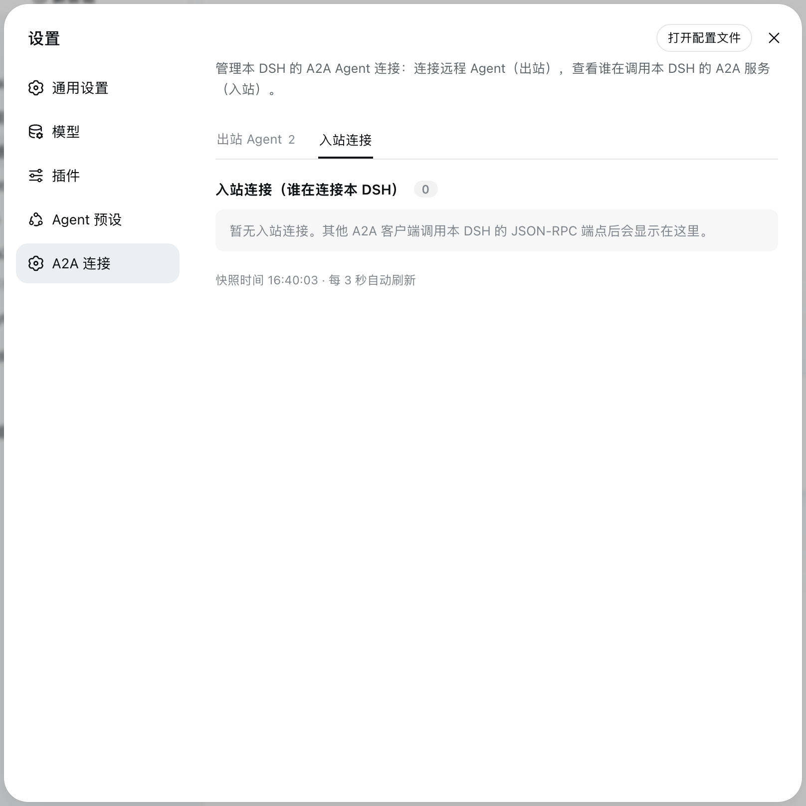
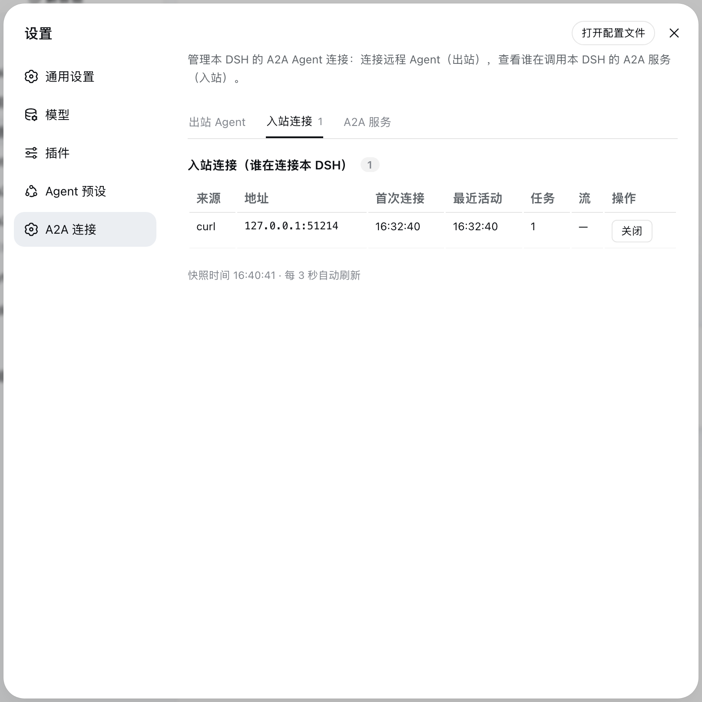
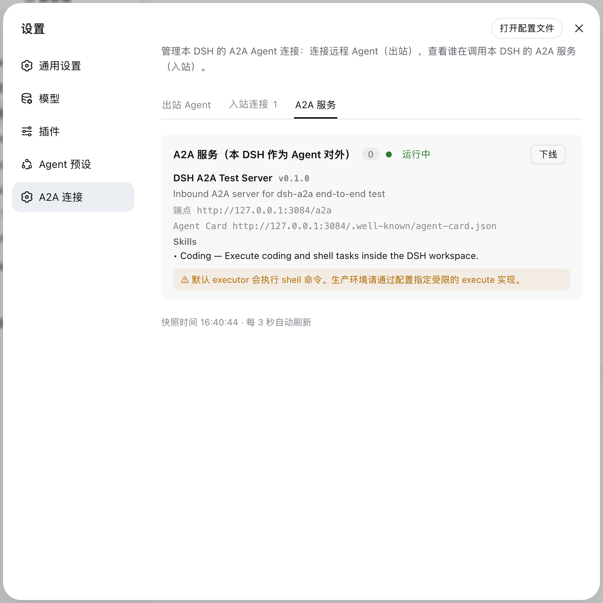

# dsh-a2a

[English](./README.md) | **中文文档**

一个 **DeepSeek Harness (DSH)** 插件，实现 **Agent2Agent (A2A) 协议 v1.0**（Linux 基金会，`a2aproject/A2A`，Apache-2.0）。

让一个 DSH 实例成为完整的 A2A 双端节点：

- **Client 模式（出站）**——通过远程 Agent 的 **AgentCard** 发现它，把每个 **skill** 映射为 DSH 模型工具（`a2a__<name>__<skill>`），通过 A2A **JSON-RPC** 执行远程任务。
- **Server 模式（入站）**——把本 DSH 暴露给其他 Agent：在 DSH webserver 上提供 `/.well-known/agent-card.json` 与 JSON-RPC 端点（`SendMessage`、`GetTask`、`ListTasks`、`CancelTask`、基于 SSE 的 `SendStreamingMessage`）。

## 功能

### 协议能力（A2A v1.0）

- **发现**：`GET /.well-known/agent-card.json`（优先 well-known，配置的 URL 兜底）
- **单次调用**：`SendMessage`、`GetTask`、`ListTasks`、`CancelTask`、`GetExtendedAgentCard`
- **流式**：`SendStreamingMessage`（SSE）/ `SubscribeToTask`，含 `TaskStatusUpdateEvent` + `TaskArtifactUpdateEvent`
- **任务生命周期**：`SUBMITTED → WORKING → COMPLETED / FAILED / CANCELED / REJECTED / INPUT_REQUIRED / AUTH_REQUIRED`
- **类型**：`Task`、`Message`、`Part`（text/raw/url/data）、`Artifact`、`AgentCard`、安全方案、扩展

### 连接面板（设置 → A2A 连接）

- **出站 Agent**：列出本 DSH 连接的远程 Agent（名称、连接状态、AgentCard URL、技能/工具数、最近活动），每个 Agent 支持 **重连 / 启用 / 禁用 / 删除**。
- **入站连接**：谁在调用本 DSH（来源、地址、首/末次连接、任务数、流式标记），支持关闭。
- **A2A 服务**：入站服务的运行状态，上线 / 下线开关，端点与技能一览。
- 面板每 3 秒自动刷新；`/a2a/api` 提供 JSON 快照与控制接口，受 loopback/same-origin 保护。

### 运行时配置（a2a.json）

配置以 **`a2a.json`（按 profile 存放，UI 可编辑）为准**，无需改动组合配置即可管理 Agent。文件定位不依赖启动目录：插件解析进程命令行里的 `--profile <name>`，读写 `~/.dsh/profiles/<name>/a2a.json`。

## 截图

| 出站 Agent（本 DSH 连接了谁） | 入站连接（谁在调用本 DSH） |
|---|---|
|  |  |

| 含真实记录的入站 | A2A 服务状态面板 |
|---|---|
|  |  |

## 安装

### 方式一：从 npm 安装（推荐）

插件发布到 npm 后，一行命令装进目标 profile，重启即生效：

    dsh plugin --profile <profile> add @ryubyte/dsh-a2a
    dsh --profile <profile>

`dsh plugin` 会把包装进 profile 并自动加入插件层（本包在 package.json 里声明了 `dsh.bundle.patch`），无需手动改任何配置。

### 方式二：从仓库安装（开发调试）

用于改代码调试，需要 Node.js >= 22 与 pnpm：

    # 1. 克隆仓库
    git clone https://github.com/ryubyte/dsh-a2a.git
    cd dsh-a2a

    # 2. 安装依赖并构建
    npm install
    npm run build

    # 3. 链接进目标 profile
    dsh plugin --profile <profile> add link:$(pwd)

    # 4. 重启
    dsh --profile <profile>

改完源码后重跑 `npm run build` 再重启即可。

## 使用

### 1. 配置远程 Agent（出站）

在 profile 目录下的 `a2a.json` 里声明要连接的 Agent：

```jsonc
{
  "agents": [
    {
      "name": "research",
      "agentCardUrl": "https://research.example.com/.well-known/agent-card.json",
      // "bearerToken": "...",
      // "timeoutMs": 8000,
      // "mapSkills": true,
      // "enabled": false        // 保留条目，但不自动连接
    }
  ]
}
```

也可以在 Web GUI「设置 → A2A 连接 → 添加 Agent」里输入 AgentCard URL 导入并连接，配置会写回 `a2a.json`。

连接成功后，对方 Agent 的 skills 会作为模型工具出现：`a2a__<name>__<skill>`。

### 2. 对外提供 A2A 服务（入站）

同样在 `a2a.json` 里开启 server 模式：

```jsonc
{
  "mode": "server",
  "server": {
    "enabled": true,             // 显式开启入站服务
    // "baseUrl": "http://127.0.0.1:3080",   // 可选；默认从 webServer 监听地址推导
    "agentName": "My DSH Agent",
    "agentDescription": "A DSH agent over A2A v1.0",
    "agentVersion": "0.1.0",
    "skills": [
      { "id": "coding", "name": "Coding", "description": "Execute coding and shell tasks.", "tags": ["coding", "shell"] }
    ]
  }
}
```

之后其他 A2A 客户端通过 `http://<host>:<port>/.well-known/agent-card.json` 发现本 DSH，通过 `/a2a` 端点调用。

> 注：默认入站 executor 会执行 shell 命令，仅适合本机自测；生产部署请通过编程方式注入受限 executor（见下文），并置于 TLS 反向代理之后。

### 3. 编程接入

```ts
import { A2AClient, A2AServer, TaskStore } from '@ryubyte/dsh-a2a';

// 出站：连接远程 Agent
const client = await A2AClient.connect('https://agent.example.com');
const { task } = await client.sendMessage({
  messageId: crypto.randomUUID(),
  role: 'ROLE_USER',
  parts: [{ text: 'Draft a report' }],
});
for await (const ev of client.streamMessage({ messageId: crypto.randomUUID(), role: 'ROLE_USER', parts: [{ text: 'hi' }] })) {
  // ev.statusUpdate | ev.artifactUpdate | ev.task | ev.message
}

// 入站：自定义 executor 接入 DSH agent 循环
const store = new TaskStore();
const server = new A2AServer({
  baseUrl: 'http://127.0.0.1:3080',
  agentName: 'My DSH',
  agentDescription: '...',
  agentVersion: '1.0.0',
  execute: async ({ message }) => ({
    messageId: crypto.randomUUID(),
    role: 'ROLE_AGENT',
    parts: [{ text: await myAgentRun(message.parts) }],
  }),
}, store);
```

## 目录结构

    src/
      protocol.ts        # A2A v1.0 类型与常量
      card.ts            # AgentCard 发现 / 校验
      jsonrpc.ts         # JSON-RPC 2.0 + SSE 传输
      client.ts          # 出站客户端（A2AClient）
      server.ts          # 入站服务 + TaskStore（A2AServer）
      outbound.ts        # skill → 模型工具桥（registerAgentTools）
      dashboard.ts       # 连接注册表 + 控制
      a2a-config.ts      # 运行时 a2a.json 解析 / 持久化
      index.ts           # Cordis 插件入口（client / server 两种模式）
      client/
        index.ts         # 浏览器半区：设置页「A2A 连接」面板
    lib/                 # 构建产物（index.js + client.js + types/）
    scripts/
      build-client.mjs   # 客户端 bundle 包装（__ModuleLoader__）
      capture-shots.mjs  # README 截图抓取（headless Chrome + CDP）
    cordis.patch.yml     # 插件注册行（bundle 自挂载，无需手动配置）
    package.json         # dsh.bundle.patch + dsh.client 清单

## 工作原理

- 插件在 `ctx.inject(...)` / `ctx.effect(...)` 内读取 `ctx.webServer` 与 `ctx.tools`（原生 Cordis 模式，与 `dsh-client-hmr` 等 bundle 一致）；缺少任一半的组合只会闲置该半区，不会崩溃。
- **server 模式 `baseUrl` 可选**：省略时 AgentCard 公布 webServer 的真实监听地址，临时端口不会发布过期 URL；仅在反向代理前置时才需显式设置。
- 客户端模式的连接生命周期钩子（`onReady` / `onDispose`）上报到**进程级共享注册表**；多个实例（client + server）共用，`/a2a/api` 每个进程注册一次。
- 所有注册 fiber 作用域化：插件停止 / 更新时由 Cordis 自动清理。
- 禁用（`enabled:false`）的 Agent 显示为灰化占位卡，**不自动连接**，直到重新启用。

## 已知限制

- 面板 API（`/a2a/api`）只监听 loopback / same-origin，供运维可见性使用，不承载机密。
- 默认入站 executor 直接执行 shell 命令（`/bin/sh -c`），非 LLM 代理；生产环境必须替换为受限 executor（如 DSH sandbox / 审批管线）。
- A2A 规范要求生产 `AgentInterface.url` 使用 HTTPS；DSH webServer 默认仅绑 loopback，对外暴露前需自行加 TLS。
- 出站的 bearer token 明文存于 `a2a.json`，请自行保证该文件权限。

## 开发

```bash
npm install
npm run build    # tsc(types) + tsdown(lib) + wrap client → lib/client.js
npm test         # node:test + tsx（单元 / 集成）+ client-bundle smoke
```